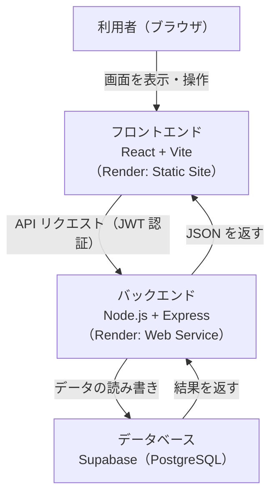
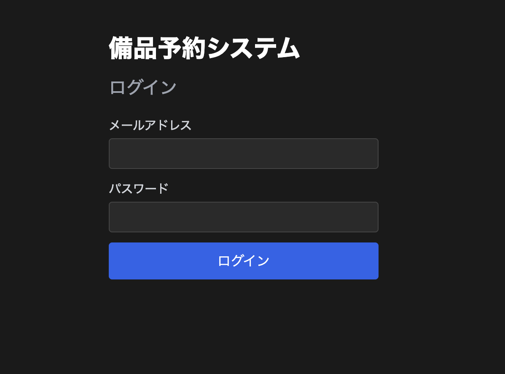
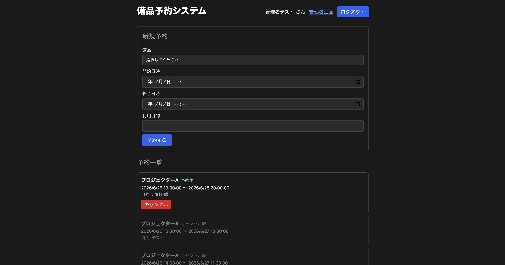
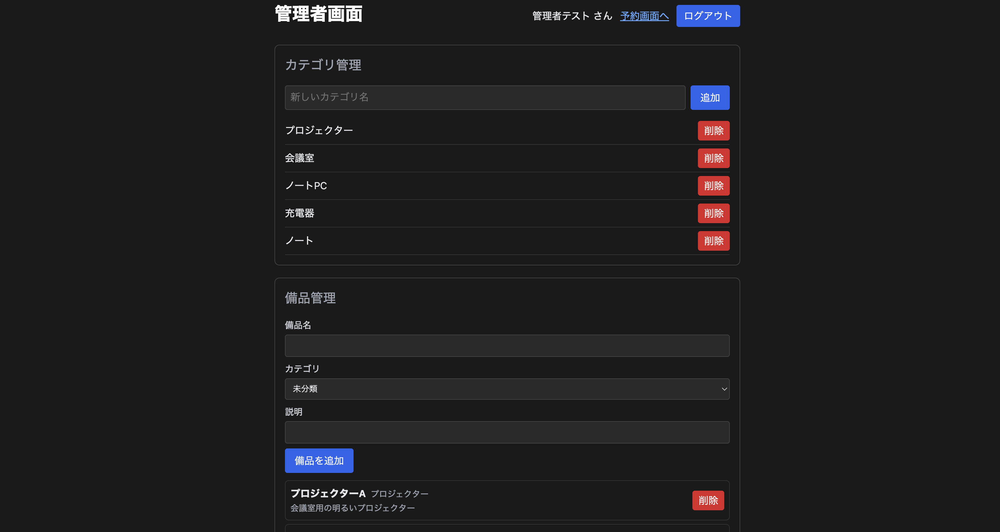
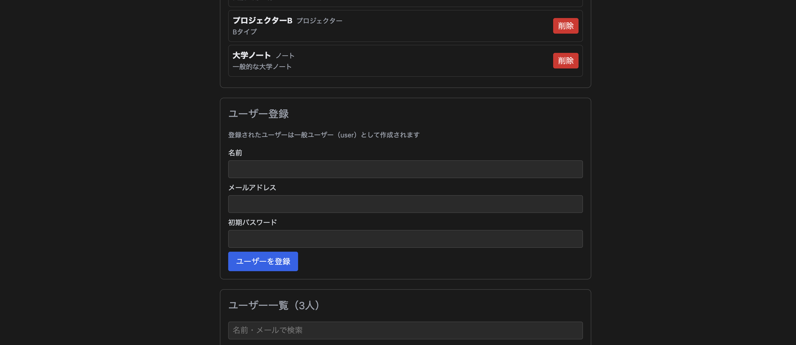
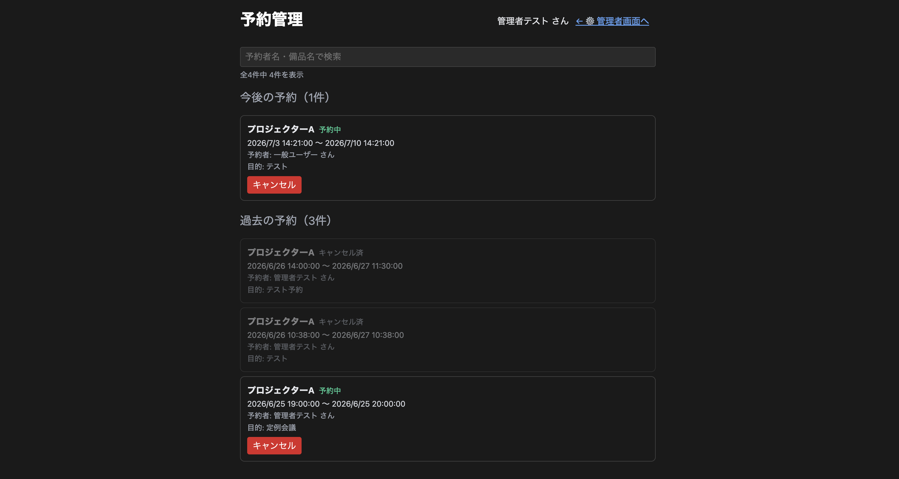

# 社内備品予約システム（Bihin Reserve）

社内の備品（プロジェクター・会議室・ノートPCなど）を、社員がオンラインで予約・キャンセルできる Web アプリケーションです。管理者は備品・カテゴリ・ユーザーの管理や、全予約の管理を行えます。大学のクラウドプラットフォーム実習の課題として、パブリッククラウド上で動作する業務アプリを開発しました。

> 本リポジトリのソースコードは学習目的で公開しています。動作環境ではテスト用のダミーデータのみを使用しており、実在する個人情報は含まれていません。

---

## 主な機能

### 一般ユーザー
- メールアドレスとパスワードによるログイン
- 備品の予約（備品・開始日時・終了日時・利用目的を指定）
- 予約のキャンセル（自分が作成した予約のみ）
- 予約一覧の閲覧（今後の予約・過去の予約を分けて表示、予約者名も表示）

### 管理者
- カテゴリの追加・削除
- 備品の追加・削除（カテゴリ・説明つき）
- ユーザーの登録・一覧・検索・編集・削除
- 予約管理画面での全予約の閲覧・検索・キャンセル（代理対応）

---

## 使用技術

| 区分 | 技術 |
| --- | --- |
| フロントエンド | React, TypeScript, Vite, React Router |
| バックエンド | Node.js, Express, TypeScript |
| データベース | Supabase (PostgreSQL) |
| 認証 | JWT (jsonwebtoken), bcryptjs によるパスワードのハッシュ化 |
| インフラ | Render（フロントエンド: Static Site / バックエンド: Web Service） |
| ソース管理 | Git, GitHub |

---

## システム構成



利用者のブラウザにはフロントエンド（静的ファイル）が配信され、画面操作に応じてバックエンドの API を呼び出します。バックエンドは JWT でリクエストを認証し、Supabase 上のデータベースとデータをやり取りします。フロントエンド・バックエンド・データベースをそれぞれ役割ごとに分離した構成にすることで、見通しがよく保守しやすい設計にしています。

---

## データベース構成

主に以下の 4 つのテーブルで構成しています。

| テーブル | 役割 |
| --- | --- |
| `users` | ユーザー情報（メール・パスワードハッシュ・名前・ロール） |
| `categories` | 備品のカテゴリ |
| `items` | 備品（カテゴリへの参照を持つ） |
| `reservations` | 予約（備品・ユーザー・期間・利用目的・状態を持つ） |

---

## 画面イメージ

### ログイン画面


### 予約画面（一般ユーザー）
新規予約フォームと、予約一覧（今後の予約・過去の予約）を表示します。


### 管理者画面
カテゴリ・備品・ユーザーを管理します。


### ユーザー登録・一覧


### 予約管理画面（管理者）
予約者名・備品名で検索しながら、全予約を閲覧・キャンセルできます。


---

## 工夫した点

### ダブルブッキング（二重予約）の防止
同じ備品に対して、時間帯が重なる予約が同時に成立しないようにしています。予約の作成時に、対象の備品ですでに有効な予約のうち時間帯が重複するものがないかをバックエンドで確認し、重複する場合はエラーを返して予約を成立させません。フロントエンドだけでなくサーバー側でチェックすることで、確実に二重予約を防いでいます。

### 最後の管理者を保護する仕組み
ユーザーのロール変更・削除の際に、システム内の管理者が 0 人になってしまう操作を防いでいます。管理者を一般ユーザーに降格、または削除しようとした場合、その時点での管理者の人数を数え、残り 1 人だけであればその操作を拒否します。これにより「誰も管理できなくなる」状態を防止しています。

### 権限に応じた表示・操作の制御
ログインしているユーザーのロール（一般 / 管理者）に応じて、表示内容や操作できる範囲を変えています。たとえば予約のキャンセルは、一般ユーザーは自分の予約のみ、管理者は全ての予約に対して行えます（代理対応）。また過去の予約は、一般ユーザーには最新の一定件数のみ、管理者には全件を表示します。

### 利用目的の入力制限
予約の利用目的は最大 500 文字までとし、フロントエンドで文字数を表示しつつ、バックエンドでも文字数を検証しています。代理予約を行う場合は、専用機能を設けず利用目的欄にその旨を記載する運用とし、シンプルさを保っています。

### セキュリティへの配慮
パスワードはハッシュ化して保存し、平文では保持していません。データベースの秘密鍵や JWT の署名鍵などの機密情報は環境変数で管理し、リポジトリには含めていません。

---

## セットアップ（ローカル実行）

> 動作には Supabase のプロジェクトと、各種環境変数の設定が必要です。

### 1. リポジトリの取得
```bash
git clone https://github.com/ABmilin/bihin-reserve.git
cd bihin-reserve
```

### 2. バックエンド
```bash
cd backend
npm install
# .env に Supabase の接続情報や JWT の鍵などを設定
npm run dev
```

### 3. フロントエンド
```bash
cd frontend
npm install
# .env に API の URL（VITE_API_URL）を設定
npm run dev
```

### 4. 環境変数の例

バックエンド（`backend/.env`）
```
SUPABASE_URL=...
SUPABASE_PUBLISHABLE_KEY=...
SUPABASE_SECRET_KEY=...
JWT_SECRET=...
FRONTEND_URL=http://localhost:5173
```

フロントエンド（`frontend/.env`）
```
VITE_API_URL=http://localhost:4000/api
```

---

## ディレクトリ構成

```
bihin-reserve/
├── backend/    # Express + TypeScript（API サーバー）
└── frontend/   # React + Vite（画面）
```
